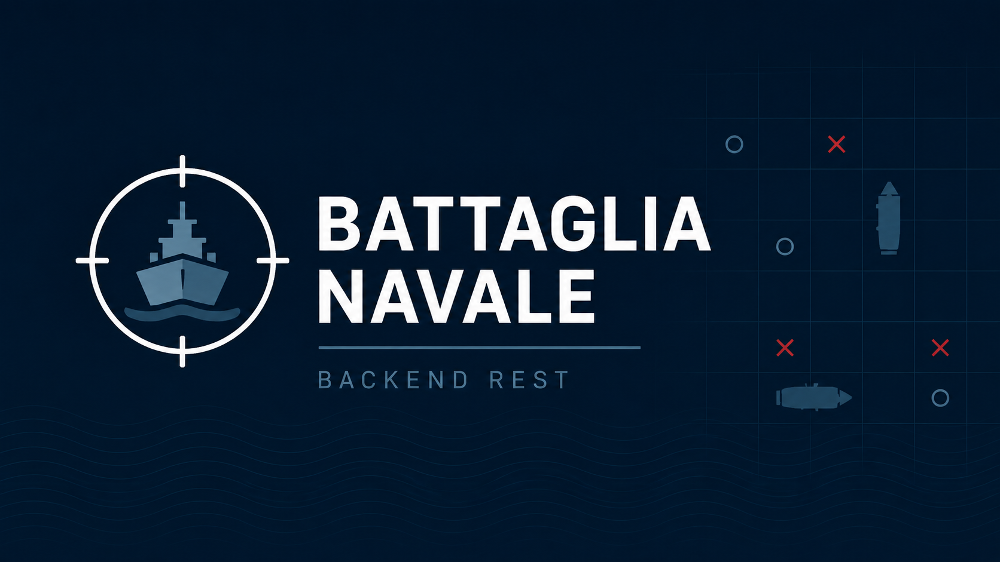
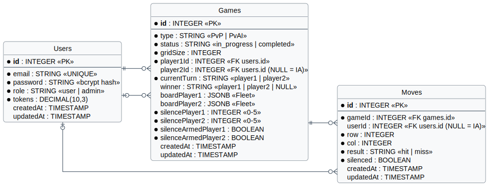
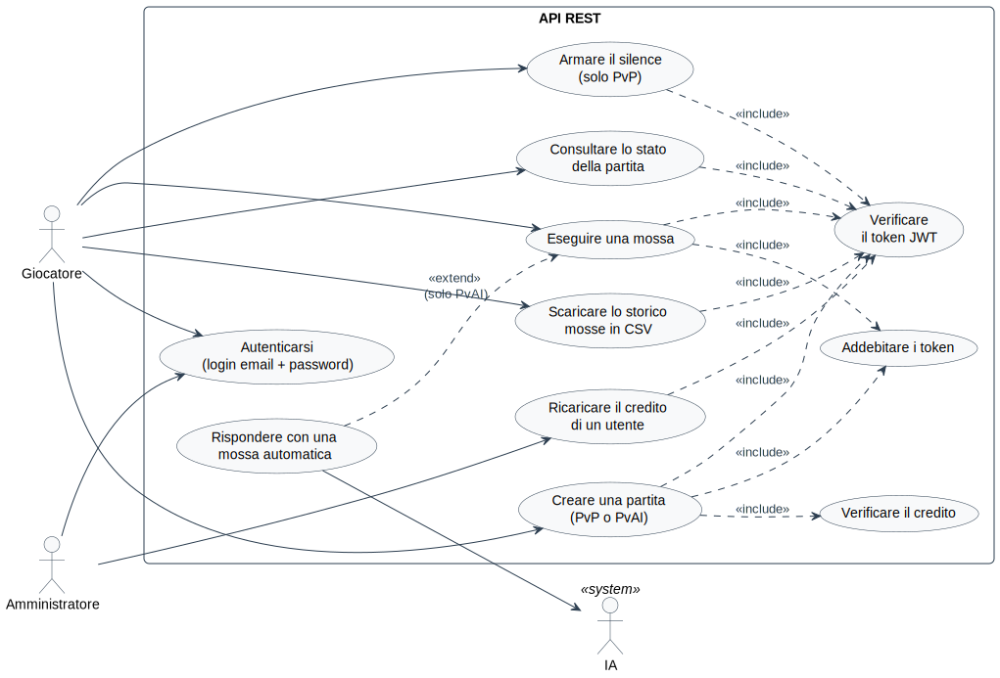
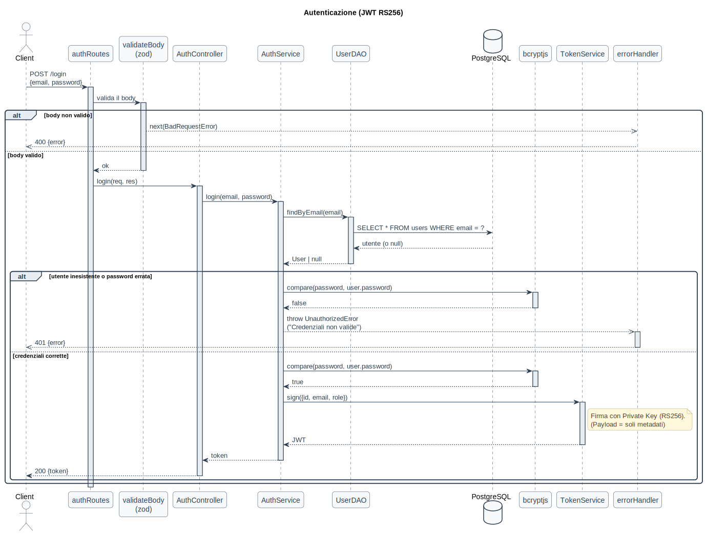
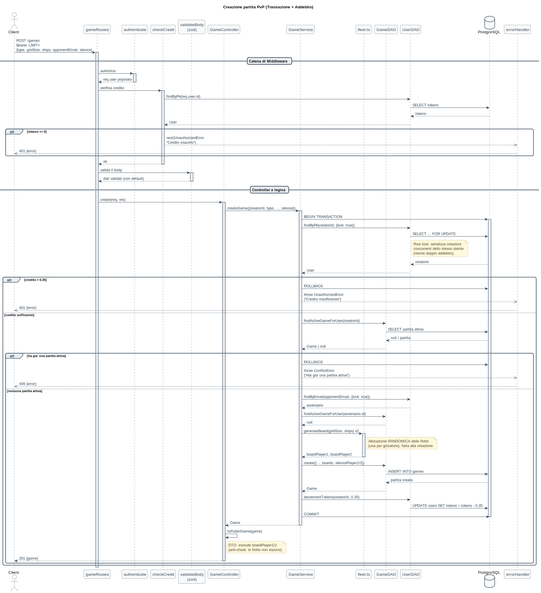
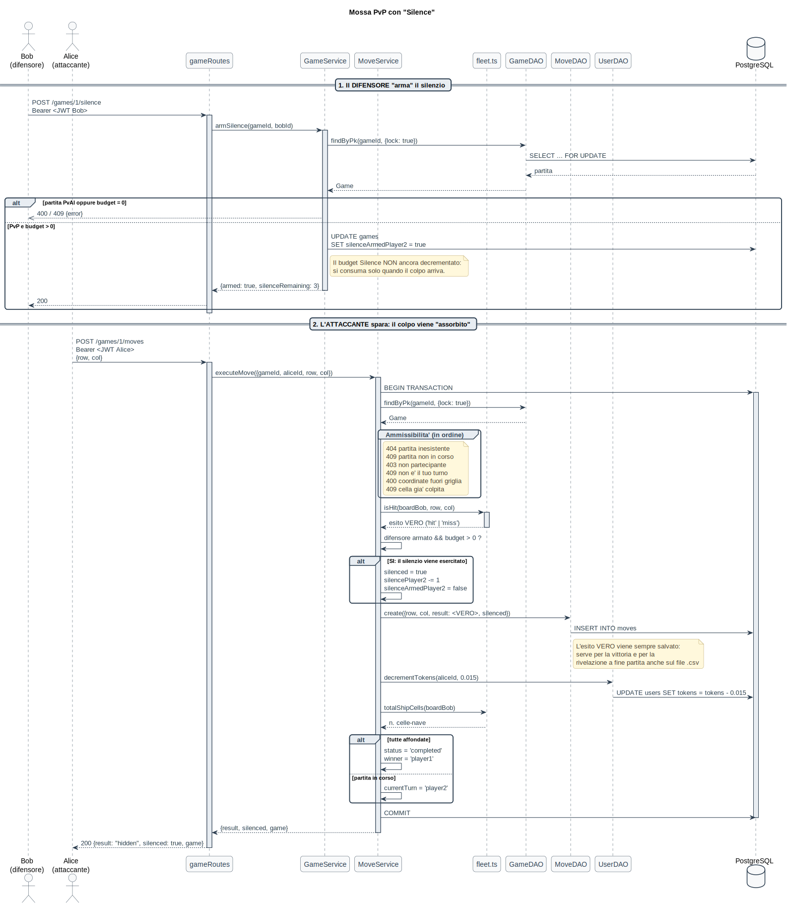
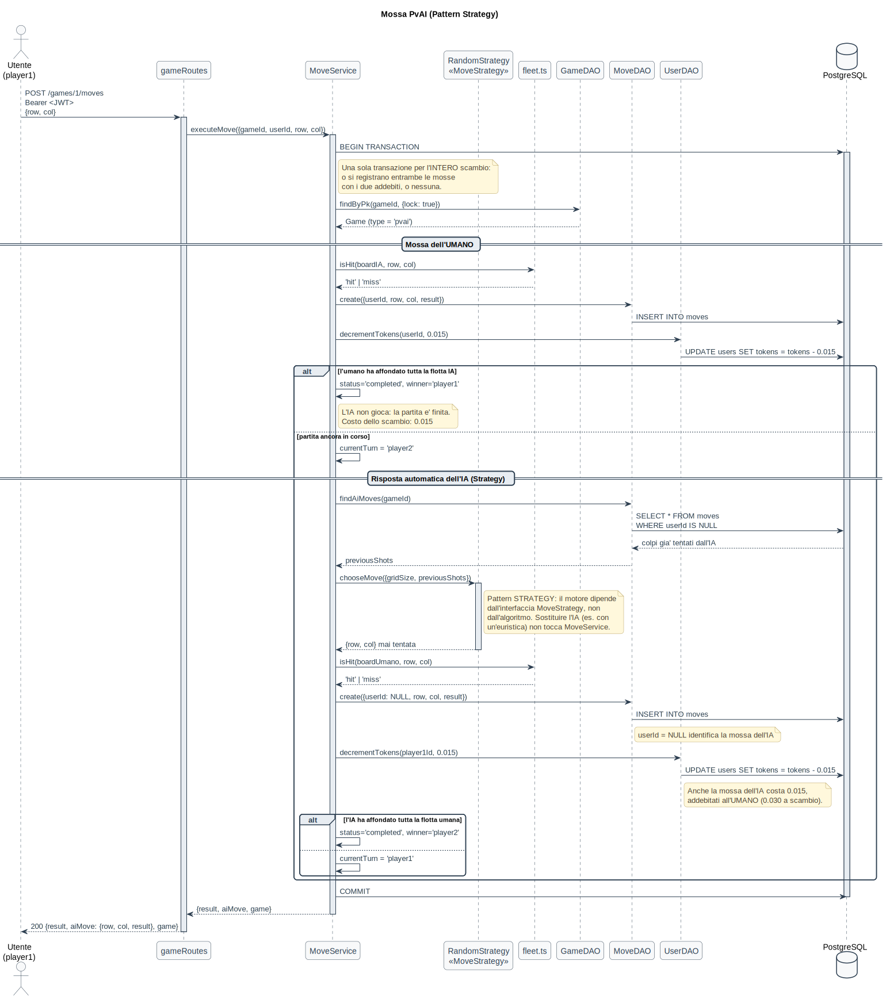

<p align="center">
  
</p>

[](https://nodejs.org/)
[](https://www.typescriptlang.org/)
[](https://expressjs.com/)
[](https://sequelize.org/)
[](https://www.postgresql.org/)
[](https://www.docker.com/)
[](https://jwt.io/)
[](https://jestjs.io/)
[](https://www.postman.com/)
[](https://www.npmjs.com/)


## Indice

1. [Obiettivo del progetto](#1-obiettivo-del-progetto)
2. [Funzionalità](#2-funzionalità)
3. [Regole di gioco e gestione del credito](#3-regole-di-gioco-e-gestione-del-credito)
4. [Stack tecnologico](#4-stack-tecnologico)
5. [Struttura del progetto](#5-struttura-del-progetto)
6. [Architettura](#6-architettura)
7. [Modello dei dati (Diagramma E-R)](#7-modello-dei-dati-diagramma-e-r)
8. [Design pattern utilizzati](#8-design-pattern-utilizzati)
9. [Diagrammi UML](#9-diagrammi-uml)
10. [API REST](#10-api-rest)
11. [Gestione degli errori](#11-gestione-degli-errori)
12. [Avvio del progetto con Docker](#12-avvio-del-progetto-con-docker)
13. [Test automatici (Jest)](#13-test-automatici-jest)
14. [Test delle API con Postman](#14-test-con-postman)


## 1. Obiettivo del progetto

L'obiettivo è realizzare il **back-end** di un sistema che permette a più utenti di giocare a **battaglia navale** tramite un'interfaccia **REST**.

Il sistema gestisce due modalità di gioco:

- **PvP** (*Player versus Player*): due utenti autenticati si sfidano a turni alternati;
- **PvAI** (*Player versus AI*): un utente sfida un avversario controllato dal sistema, le cui mosse sono scelte da una strategia intercambiabile.

Ogni operazione di gioco consuma **credito** (token frazionari) dell'utente, e ogni richiesta protetta richiede un **token JWT** firmato con algoritmo asimmetrico **RS256**.

## 2. Funzionalità

| Funzionalità | Descrizione |
|---|---|
| **Autenticazione** | Login con email e password (hash **bcrypt**); rilascio di un **JWT RS256** contenente i soli metadati dell'utente. |
| **Creazione partita** | PvP (indicando l'email dell'avversario) o PvAI. Le flotte vengono allocate in modo **randomico** dal sistema. |
| **Esecuzione mossa** | Colpo su una cella della griglia avversaria, con esito *hit* / *miss*, alternanza del turno e rilevamento della vittoria. |
| **Avversario IA** | Nel PvAI, la stessa richiesta di mossa innesca la **risposta automatica** dell'IA, la cui cella è scelta tramite il pattern **Strategy**. |
| **Modalità silence** | Il giocatore che **subisce** un attacco può "armare" il silenzio: l'esito del colpo non viene rivelato all'attaccante fino a fine partita. |
| **Stato partita** | Restituisce turno, stato, vincitore e i soli colpi già sparati (mai le navi avversarie non colpite). |
| **Storico mosse in CSV** | Esportazione dello storico delle mosse di una partita, riservata ai partecipanti. |
| **Ricarica credito** | Rotta riservata al ruolo **admin** per impostare il credito di un utente. |
| **Gestione credito** | Addebito automatico e atomico; blocco (401) delle nuove partite a credito esaurito. |


## 3. Regole di gioco e gestione del credito

### Costi delle operazioni

| Operazione | Costo | A carico di |
|---|---|---|
| Creazione di una partita | **0.35** token | Creatore |
| Esecuzione di una mossa | **0.015** token | Giocatore che muove |
| Mossa automatica dell'IA | **0.015** token | **Utente umano** (unico account con credito) |

> **Nel PvAI un singolo scambio costa quindi 0.030 token** all'utente: 0.015 per la propria mossa e 0.015 per la risposta dell'IA. Se la mossa dell'utente chiude la partita, l'IA non gioca e il costo è di soli 0.015.

I token sono **frazionari** e memorizzati come `DECIMAL(10,3)`: l'aritmetica è esatta, senza gli errori di arrotondamento tipici dei numeri in virgola mobile.

### Regola del credito esaurito

Due clausole delle specifiche vanno lette insieme:

- *"Se il credito scende sotto zero durante la partita, si può continuare comunque."*
- *"A token terminati, la richiesta deve restituire 401."*


| Richiesta | Credito esaurito (≤ 0) |
|---|---|
| **Creazione** di una nuova partita | **401 Unauthorized** |
| **Mossa** in una partita già in corso | **Consentita**  |
| **Stato** / **storico** di una partita in corso | **Consentiti** (solo lettura) |

### Altre regole

- **Una sola partita attiva per utente** alla volta (409 in caso contrario).
- **Anti-cheat**: le posizioni delle navi (`boardPlayer1` / `boardPlayer2`) risiedono nel database ma **non vengono mai esposte** dalle API.
- La **vittoria** si verifica quando tutte le celle occupate dalle navi avversarie sono state colpite.

### Modalità silence

Il parametro `silence` (0–5) impostato alla creazione è un **budget per giocatore**. Funzionamento:

1. il difensore **"arma"** il silenzio con `POST /games/:id/silence` (richiede budget > 0);
2. quando l'avversario spara, il colpo viene **assorbito**: la mossa è registrata con l'**esito vero** nel db, ma all'attaccante viene restituito il valore `hidden`;
3. il budget del difensore cala di 1 e il flag si **disarma**;
4. a **fine partita** tutti gli esiti vengono rivelati.

Il silence **non è automatico**: senza un'esplicita chiamata di *arming*, nessun colpo viene silenziato, anche se il budget è positivo. È disponibile **solo nelle partite PvP**.


## 4. Stack tecnologico

| Tecnologia | Ruolo |
|---|---|
| **Node.js 24** | Ambiente di esecuzione |
| **TypeScript 6** | Linguaggio |
| **Express 5** | Framework HTTP (routing e middleware) |
| **Sequelize 6** | ORM per PostgreSQL |
| **PostgreSQL 16** | Database relazionale |
| **Docker / Docker Compose** | Containerizzazione e orchestrazione (app + db) |
| **jsonwebtoken** | Emissione e verifica di JWT con algoritmo **RS256** |
| **bcryptjs** | Hashing delle password |
| **zod 4** | Validazione degli input |
| **http-status-codes** | codici HTTP |
| **Jest + supertest** | Test unitari e di integrazione |


## 5. Struttura del progetto

```
Progetto-Programmazione-Avanzata/
│
├── docs/                          # diagrammi UML e materiale pubblico
│
├── postman/                       # collection Postman
│
├── src/
│   ├── @types/                    # augmentation di Express.Request
│   │
│   ├── config/                    # pattern SINGLETON
│   │
│   ├── controller/                # adattatori HTTP
│   │
│   ├── dao/                       # pattern DAO: unico livello che parla con Sequelize
│   │
│   ├── database/                  # contiene seeders e migrations
│   │
│   ├── dto/                       # vista pubblica della partita
│   │
│   ├── errors/                    # pattern FACTORY
│   │
│   ├── middleware/                # pattern CHAIN OF RESPONSIBILITY
│   │
│   ├── model/                     # modelli Sequelize
│   │
│   ├── routes/                    # definizione degli endpoint e delle catene
│   │
│   ├── secrets/                   # chiavi RS256
│   │
│   ├── service/                   # logica di dominio
│   │
│   ├── strategy/                  # pattern STRATEGY (IA)
│   │
│   ├── utils/
│   │   ├── asyncHandler.ts        # wrapper per gli errori nelle funzioni async
│   │   ├── csv.ts                 # serializzazione CSV (RFC 4180)
│   │   └── fleet.ts               # logica: flotte, hit/miss e conteggio celle
│   │
│   ├── validation/                # schemi zod
│   │
│   └── index.ts                   # bootstrap dell'applicazione
│
├── .env.example                   # variabili d'ambiente di esempio
├── .sequelizerc                   # percorsi per sequelize-cli
├── Dockerfile
├── docker-compose.yml
├── entrypoint.sh                  # routine avvio Docker
├── jest.config.js
├── tsconfig.json                  # configurazione per editor e typecheck (include i test)
└── tsconfig.build.json            # configurazione di build
```


## 6. Architettura

L'applicazione è organizzata **a livelli**, ciascuno con una singola responsabilità. Una richiesta HTTP attraversa i seguenti livelli:

```
routes → middleware → controller → service → dao → model → PostgreSQL
```

| Livello | Responsabilità |
|---|---|
| **routes** | Associa URL e metodi HTTP alla catena di middleware |
| **middleware** | Autenticazione, verifica del credito, validazione, gestione degli errori |
| **controller** | Estrae i dati dalla richiesta, invoca il service, formatta la risposta |
| **service** | Regole di gioco, transazioni, coerenza dei dati |
| **dao** | Accesso ai dati (unico livello che usa Sequelize) |
| **model** | Definizione delle tabelle e dei vincoli |

**Il vantaggio pratico:** un cambiamento resta confinato in un livello. Sostituire il database implica riscrivere solo i DAO; cambiare il formato di una risposta tocca solo il controller; modificare una regola di gioco tocca solo il service.


## 7. Modello dei dati (Diagramma E-R)

<p align="center">
  
</p>


### Note sul modello

- **`users.tokens` è `DECIMAL(10,3)`**: i costi sono frazionari e il `DECIMAL` garantisce un'aritmetica esatta.
- **`games.player2Id` è NULLABLE**: nel PvAI il secondo giocatore non è un utente del sistema. Per la stessa ragione **`moves.userId` è NULLABLE**, dove `NULL` identifica una **mossa dell'IA**.
- **Le flotte sono colonne `JSONB`** (`boardPlayer1`, `boardPlayer2`): la struttura è annidata e può evolvere senza migrazioni. **Non vengono mai esposte dalle API**.
- Gli stati (`role`, `type`, `status`, `result`, …) sono `STRING` con validazione applicativa (`isIn`) anziché ENUM nativi di Postgres: si evitano le fragili migrazioni di `ALTER TYPE` e l'insieme dei valori resta facilmente estendibile.


## 8. Design pattern utilizzati

### 8.1 Singleton (Connessione al DB)

**Problema.** Aprire connessioni al database è costoso e averne più d'una porta a comportamenti incoerenti.

**Soluzione.** `DatabaseConnection` ha **costruttore privato** e un metodo statico `getInstance()`: l'istanza di Sequelize viene creata **una sola volta**, al primo utilizzo, e condivisa da tutti i modelli e i DAO.

```typescript
class DatabaseConnection {
  private static instance: DatabaseConnection;
  private readonly sequelize: Sequelize;

  private constructor() {                       // nessuno può fare "new" dall'esterno
    this.sequelize = new Sequelize(/* configurazione dal .env */);
  }

  public static getInstance(): DatabaseConnection {
    if (!DatabaseConnection.instance) {
      DatabaseConnection.instance = new DatabaseConnection();
    }
    return DatabaseConnection.instance;
  }

  public getSequelize(): Sequelize {
    return this.sequelize;
  }
}
```

### 8.2 DAO (Data Access Object)

**Problema.** Se i service invocassero direttamente Sequelize, la logica di gioco risulterebbe legata a una specifica tecnologia di persistenza.

**Soluzione.** Un livello DAO incapsula l'ORM ed espone metodi di dominio. La classe generica `BaseDAO<M>` fornisce le operazioni CRUD comuni mentre i DAO concreti aggiungono i metodi specifici (`findByEmail`, `decrementTokens`, …).

```typescript
export abstract class BaseDAO<M extends Model> {
  protected readonly model: ModelStatic<M>;

  protected constructor(model: ModelStatic<M>) {
    this.model = model;
  }

  public async findByPk(id: number, options?: FindOptions<Attributes<M>>): Promise<M | null> {
    return this.model.findByPk(id, options);
  }
  // create, findAll, findOne, update, delete...
}
```

Il parametro `options` consente ai service di propagare **transazione** e **lock** fino al DAO senza che questo conosca la logica di gioco.

### 8.3 Chain of Responsibility (Middleware)
**Problema.** Ogni richiesta protetta richiede una sequenza di controlli indipendenti (identità, credito, forma dei dati).

**Soluzione.** Ogni controllo è un **middleware** autonomo che decide se proseguire (`next()`) o interrompere la catena (`next(err)`). Le rotte compongono le catene:

```typescript
router.post('/games', authenticate, checkCredit, validateBody(createGameSchema), asyncHandler(gameController.create));
router.post('/games/:id/moves', authenticate, validateBody(moveSchema), asyncHandler(gameController.move));
router.post('/admin/recharge', authenticate, requireAdmin, validateBody(rechargeSchema), asyncHandler(adminController.recharge));
```

L'anello **terminale** della catena è l'`errorHandler`, montato per ultimo: qualunque errore sollevato da qualunque anello confluisce lì e diventa una risposta JSON uniforme.

### 8.4 Factory (Errori)

**Problema.** Istanziare classi di errore concrete in tutto il codice crea dipendenze diffuse e messaggi incoerenti.

**Soluzione.** `ErrorFactory.create(type, message)` centralizza la costruzione. Il codice chiamante chiede "un errore di tipo X" senza conoscere le classi concrete; ogni tipo porta con sé il proprio codice HTTP.

```typescript
export class ErrorFactory {
  public static create(type: ErrorType, message?: string): AppError {
    switch (type) {
      case ErrorType.BadRequest:   return new BadRequestError(message);
      case ErrorType.Unauthorized: return new UnauthorizedError(message);
      case ErrorType.Forbidden:    return new ForbiddenError(message);
      case ErrorType.NotFound:     return new NotFoundError(message);
      case ErrorType.Conflict:     return new ConflictError(message);
      default:                     return new InternalServerError(message);
    }
  }
}

// utilizzo, ovunque nel codice:
throw ErrorFactory.create(ErrorType.Conflict, "Non e' il tuo turno");
```

### 8.5 Strategy (mossa dell'IA)

**Problema.** L'algoritmo con cui l'IA sceglie la cella su cui sparare deve poter cambiare (da casuale a euristico) senza modificare il motore di gioco.

**Soluzione.** La scelta è astratta dietro l'interfaccia `MoveStrategy`. `MoveService` dipende dall'**interfaccia**, non dall'implementazione, che viene iniettata nel costruttore:

```typescript
export interface MoveStrategy {
  chooseMove(context: AiMoveContext): { row: number; col: number };
}

export class RandomStrategy implements MoveStrategy {
  public chooseMove(context: AiMoveContext): { row: number; col: number } {
    // sceglie una cella casuale fra quelle mai tentate
  }
}

export class MoveService {
  private readonly aiStrategy: MoveStrategy;

  constructor(aiStrategy: MoveStrategy = new RandomStrategy()) {
    this.aiStrategy = aiStrategy;
  }
}
```

Il contesto passato alla strategia (`gridSize`, `previousShots` con i relativi esiti) è già sufficiente a implementare una futura euristica **senza modificare `MoveService`**.

## 9. Diagrammi UML

### 9.1 Diagramma dei casi d'uso

<p align="center">
  
</p>

Gli attori sono il **Giocatore**, l'**Amministratore** e l'**IA** (attore di sistema). Le relazioni `<<include>>` evidenziano i comportamenti sempre eseguiti (verifica del token, verifica del credito, addebito); la relazione `<<extend>>` mostra che la risposta automatica dell'IA **estende** il caso d'uso "Eseguire una mossa" soltanto nelle partite PvAI.

### 9.2 Diagrammi di sequenza

#### `POST /login` (Autenticazione)

<p align="center">
  
</p>

#### `POST /games` (Creazione partita)

<p align="center">
  
</p>

Evidenzia la catena di middleware, la **transazione** con **row lock** che serializza le creazioni concorrenti, l'allocazione randomica delle flotte e l'addebito atomico di 0.35 token.

#### `POST /games/:id/moves` (Mossa PvP con silence)

<p align="center">
  
</p>

Mostra le due fasi distinte: il **difensore "arma"** il silenzio (il budget non viene ancora consumato) e, quando l'attaccante spara, il colpo viene **assorbito** (l'esito vero è salvato, ma la risposta all'attaccante è `hidden`).

#### `POST /games/:id/moves` (Mossa PvAI)

<p align="center">
  
</p>

Una sola richiesta innesca **due mosse** (umano e IA) all'interno della **stessa transazione**, con **due addebiti** da 0.015 a carico dell'utente. La cella dell'IA è scelta dalla `RandomStrategy`.


## 10. API REST

**Base URL:** `http://localhost:3000`

| Metodo | Endpoint | Autenticazione | Descrizione |
|---|---|---|---|
| `GET` | `/health` | — | Stato del servizio |
| `POST` | `/login` | — | Autenticazione, restituisce il JWT |
| `GET` | `/me` | JWT | Metadati dell'utente autenticato |
| `POST` | `/games` | JWT + credito | Crea una partita (PvP o PvAI) |
| `POST` | `/games/:id/moves` | JWT | Esegue una mossa |
| `POST` | `/games/:id/silence` | JWT | Il difensore arma il silenzio |
| `GET` | `/games/:id` | JWT | Stato della partita |
| `GET` | `/games/:id/moves/csv` | JWT | Storico mosse in formato CSV |
| `POST` | `/admin/recharge` | JWT + ruolo admin | Imposta il credito di un utente |

Tutte le rotte protette richiedono l'header:

```
Authorization: Bearer <token>
```

---

### `POST /login`

Autentica un utente e restituisce un token JWT firmato in RS256.

| Posizione | Nome | Tipo | Obbligatorio | Descrizione |
|---|---|---|---|---|
| body | `email` | string | Sì | Email dell'utente |
| body | `password` | string | Sì | Password in chiaro (confrontata con l'hash bcrypt) |

**Richiesta**

```json
{
  "email": "alice@example.com",
  "password": "alice123"
}
```

**Risposta: `200 OK`**

```json
{
  "token": "eyJhbGciOiJSUzI1NiIsInR5cCI6IkpXVCJ9..."
}
```

**Errori:** `400` body non valido · `401` credenziali non valide.

---

### `GET /me`

Restituisce i metadati dell'utente autenticato, così come contenuti nel token.

**Risposta: `200 OK`**

```json
{
  "user": { "id": 2, "email": "alice@example.com", "role": "user" }
}
```

---

### `POST /games`

Crea una nuova partita. Addebita **0.35** token al creatore e alloca le flotte in modo randomico.

| Posizione | Nome | Tipo | Obbligatorio | Default | Descrizione |
|---|---|---|---|---|---|
| body | `type` | `"pvp"` \| `"pvai"` | Sì | — | Modalità di gioco |
| body | `opponentEmail` | string | Solo se `pvp` | — | Email dell'avversario.|
| body | `gridSize` | number (5–20) | No | `10` | Lato della griglia |
| body | `ships` | number[] | No | `[5,4,3,3,2]` | Dimensioni delle navi |
| body | `silence` | number (0–5) | No | `0` | Budget silence **per giocatore**.|

**Richiesta (PvP)**

```json
{
  "type": "pvp",
  "opponentEmail": "bob@example.com",
  "silence": 3
}
```

**Risposta: `201 Created`**

```json
{
  "game": {
    "id": 1,
    "type": "pvp",
    "status": "in_progress",
    "gridSize": 10,
    "player1Id": 2,
    "player2Id": 3,
    "currentTurn": "player1",
    "winner": null,
    "createdAt": "2026-07-12T10:15:20.198Z"
  }
}
```

> La risposta **non contiene** le flotte: sono salvate nel database ma mai esposte.

**Errori:** 
- `400` validazione (es. `opponentEmail` mancante in PvP, o presente in PvAI) 
- `401` token assente o **credito esaurito/insufficiente**
- `404` avversario inesistente
- `409` partita già attiva (propria o dell'avversario).

---

### `POST /games/:id/moves`

Esecuzione di una mossa

| Posizione | Nome | Tipo | Obbligatorio | Descrizione |
|---|---|---|---|---|
| path | `id` | number | Sì | ID della partita |
| body | `row` | number ≥ 0 | Sì | Riga (0-based) |
| body | `col` | number ≥ 0 | Sì | Colonna (0-based) |

**Richiesta**

```json
{ "row": 0, "col": 0 }
```

**Risposta (PvP):  `200 OK`**

```json
{
  "result": "miss",
  "game": { "id": 1, "status": "in_progress", "currentTurn": "player2", "winner": null }
}
```

**Risposta (PvP, colpo silenziato dal difensore): `200 OK`**

```json
{
  "result": "hidden",
  "silenced": true,
  "game": { "id": 1, "status": "in_progress", "currentTurn": "player2", "winner": null }
}
```

**Risposta (PvAI): `200 OK`**

```json
{
  "result": "miss",
  "aiMove": { "row": 5, "col": 2, "result": "hit" },
  "game": { "id": 2, "status": "in_progress", "currentTurn": "player1", "winner": null }
}
```

**Errori:** 
- `400` coordinate fuori griglia o body non valido
- `401` token assente
- `403` non partecipi alla partita
- `404` partita inesistente
- `409` partita conclusa, turno errato o cella già colpita.

---

### `POST /games/:id/silence`

Il **difensore** arma il silenzio sul prossimo colpo che subirà. Richiede budget > 0. Nessun body.

**Risposta: `200 OK`**

```json
{ "armed": true, "silenceRemaining": 3 }
```

> `silenceRemaining` è il budget **prima** del consumo: il decremento avviene quando il colpo viene effettivamente assorbito.

**Errori:** `400` partita PvAI (silence non disponibile)
- `403` non partecipi alla partita
- `404` partita inesistente
- `409` partita conclusa o **silence esaurito**.

---

### `GET /games/:id`

Restituisce lo stato della partita dal punto di vista del richiedente.

**Risposta: `200 OK`**

```json
{
  "game": {
    "id": 1, "type": "pvp", "status": "in_progress", "gridSize": 10,
    "player1Id": 2, "player2Id": 3, "currentTurn": "player1", "winner": null
  },
  "you": "player1",
  "yourTurn": true,
  "myShots": [ { "row": 0, "col": 0, "result": "hidden", "silenced": true } ],
  "shotsAgainstMe": [ { "row": 5, "col": 5, "result": "miss" } ]
}
```

>**Anti-cheat.** Vengono restituiti **solo i colpi già sparati**, mai le celle-nave avversarie non ancora colpite. I propri colpi **silenziati** appaiono come `hidden` finché la partita è in corso, e vengono rivelati alla sua conclusione

**Errori:** 
- `403` non partecipi alla partita
- `404` partita inesistente.

---

### `GET /games/:id/moves/csv`

Esporta lo storico delle mosse della partita in formato CSV. Riservato ai **partecipanti**.

**Risposta: `200 OK`** (`Content-Type: text/csv`)

| n | player | row | col | result | silenced | timestamp |
| :-: | :--- | :-: | :-: | :--- | :-: | :--- |
| 1 | player1 | 0 | 3 | hidden | true | 2026-07-12T10:20:18.538Z |
| 2 | player2 | 0 | 0 | miss | false | 2026-07-12T10:20:18.546Z |
| 3 | IA | 7 | 4 | hit | false | 2026-07-12T10:20:19.101Z |


**Errori:** 
- `403` non partecipi alla partita
- `404` partita inesistente.

---

### `POST /admin/recharge`

Imposta il credito di un utente. Riservato al ruolo **admin**.

| Posizione | Nome | Tipo | Obbligatorio | Descrizione |
|---|---|---|---|---|
| body | `email` | string | Sì | Email dell'utente da ricaricare |
| body | `tokens` | number ≥ 0 | Sì | **Nuovo** valore del credito |

**Richiesta**

```json
{ "email": "charlie@example.com", "tokens": 10 }
```

**Risposta: `200 OK`**

```json
{ "email": "charlie@example.com", "tokens": 10 }
```

> **Semantica SET, non ADD**: il credito viene *impostato* al valore fornito, coerentemente con la specifica ("fornendo la mail e il nuovo credito").

**Errori:** 
- `400` body non valido (es. `tokens` negativo)
- `401` token assente
- `403` utente non amministratore
- `404` utente inesistente.


## 11. Gestione degli errori

Gli errori **non** vengono gestiti nei singoli handler: ogni livello **solleva un'eccezione** costruita dalla `ErrorFactory`, e un **unico middleware terminale** (`errorHandler`) la traduce in una risposta JSON uniforme.

```json
{
  "error": {
    "name": "ConflictError",
    "message": "Non e' il tuo turno"
  }
}
```

| Codice | Classe | Quando |
|---|---|---|
| `400` | `BadRequestError` | Validazione zod fallita, coordinate fuori griglia, ID non valido |
| `401` | `UnauthorizedError` | Token assente/non valido/scaduto, credenziali errate, credito esaurito |
| `403` | `ForbiddenError` | Non partecipi alla partita, operazione riservata agli amministratori |
| `404` | `NotFoundError` | Partita, utente o avversario inesistente |
| `409` | `ConflictError` | Partita già attiva, turno errato, cella già colpita, partita conclusa, silence esaurito |
| `500` | `InternalServerError` | Errore imprevisto (messaggio **generico**: nessun dettaglio interno esposto) |


## 12. Avvio del progetto con Docker

### Prerequisiti

- **Docker** e **Docker Compose** installati e in esecuzione.
- Nessun'altra installazione è necessaria: Node.js e PostgreSQL girano dentro i container.

### Passi

**1. Clonare il repository**

```bash
git clone https://github.com/Anass-Chebbaki/Progetto-Programmazione-Avanzata.git
cd Progetto-Programmazione-Avanzata
```

**2. Creare il file `.env`** a partire dall'esempio fornito:

```bash
cp .env.example .env
```

Contenuto:

```env
PORT=3000
NODE_ENV=development

DB_HOST=postgres          
DB_PORT=5432
DB_NAME=battaglia_navale
DB_USERNAME=postgres
DB_PASSWORD=postgres

PRIVATE_KEY_PATH=./src/secrets/jwtRS256.key
PUBLIC_KEY_PATH=./src/secrets/jwtRS256.key.pub
JWT_EXPIRES_IN=1h
```

> Il file `.env` contiene solo i **percorsi** delle chiavi, mai le chiavi stesse.

**3. Avviare lo stack**

```bash
docker compose up --build
```

**Cosa accade all'avvio** (script `entrypoint.sh`, eseguito nel container `app`):

1. **generazione della coppia di chiavi RSA** per i JWT, *solo se non esistono già* (operazione **idempotente**: al riavvio i token già emessi restano validi);
2. **attesa** che PostgreSQL accetti connessioni (`pg_isready`);
3. esecuzione delle **migrazioni** (creazione dello schema);
4. esecuzione dei **seed**;
5. **avvio** del server.

Il servizio è pronto quando compare il messaggio di ascolto sulla porta **3000**. Verifica rapida:

```bash
curl http://localhost:3000/health
```

**4. Arrestare lo stack**

```bash
docker compose down        # arresta i container, conserva i dati
docker compose down -v     # arresta e AZZERA il database (rimuove il volume)
```


### Utenti predefiniti (seed)

| Email | Password | Ruolo | Credito iniziale |
|---|---|---|---|
| `admin@example.com` | `admin123` | `admin` | 100.000 |
| `alice@example.com` | `alice123` | `user` | 5.000 |
| `bob@example.com` | `bob123` | `user` | 5.000 |
| `charlie@example.com` | `charlie123` | `user` | **0.000** |

> `charlie` ha credito nullo di proposito: consente di verificare immediatamente il **blocco 401**.

### Ispezione del DB

```bash
docker exec -it battaglia_navale_db psql -U postgres -d battaglia_navale -c "SELECT email, tokens FROM users;"
docker exec -it battaglia_navale_db psql -U postgres -d battaglia_navale -c "SELECT * FROM moves;"
```


## 13. Test automatici (Jest)

Il progetto testa meidante Jest **tre** middleware, più un test di **integrazione** dell'intera catena.

```bash
npm test
```

```
PASS  src/middleware/__tests__/chain.integration.test.ts
PASS  src/middleware/__tests__/adminMiddleware.test.ts
PASS  src/middleware/__tests__/authMiddleware.test.ts
PASS  src/middleware/__tests__/creditMiddleware.test.ts

Test Suites: 4 passed, 4 total
Tests:       17 passed, 17 total
```

## 14. Test con Postman

Nella cartella [`postman/`](postman/) è disponibile una **collection** pronta all'uso.

### Utilizzo

Le richieste di **login** salvano automaticamente il token nelle variabili della collection (tramite uno script di test), quindi le richieste successive sono già autenticate: non è necessario copiare i token manualmente.

La collection è organizzata per scenari:

| Cartella | Contenuto |
|---|---|
| **Auth** | Login dei quattro utenti seed, `/me` |
| **Partita PvP** | Creazione, mosse alternate, stato |
| **Partita PvAI** | Creazione contro l'IA, mossa con risposta automatica |
| **Silence** | Arming da parte del difensore, colpo silenziato, verifica del mascheramento |
| **Storico CSV** | Esportazione dello storico |
| **Admin** | Ricarica del credito |
| **Casi d'errore** | 400, 401 (token e credito), 403, 404, 409 |


## Autore

Chebbaki Anass
